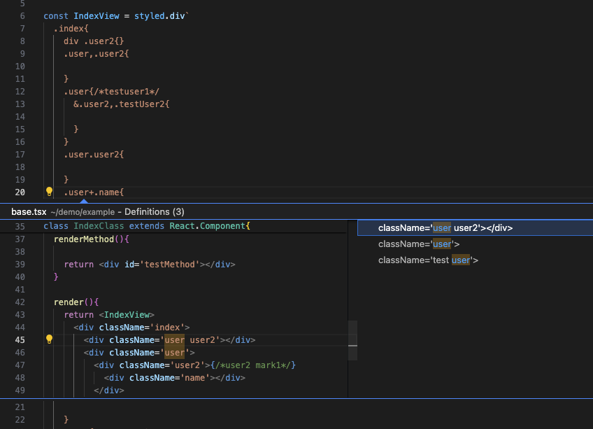
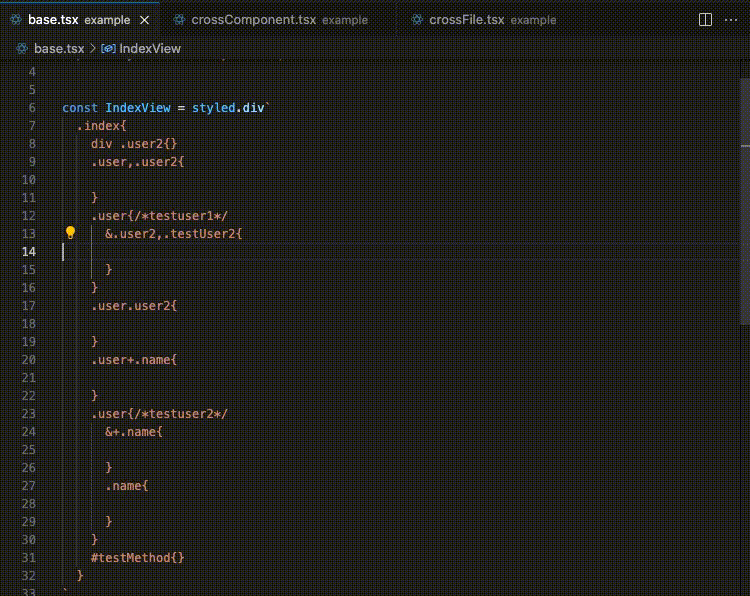

# Typescript-styled-intelligent-plugin
### A styled-components plugins
### 描述
typescript-styled-intelligent-plugin是一个辅助工具，通过提供智能导航支持来增强styled-components的功能，实现css的选择器的智能跳转。


项目结构
这个仓库有两个项目：

- `packages/typescript-styled-intelligent-plugin` 是一个Typescript Plugin   
- `packages/vscode-styled-intelligent-plugin` 这是一个vscode插件 (是基于typescript-styled-intelligent-plugin实现)





### 使用方法
####  使用VSCode（推荐）
从release页面下载最新的vsix文件。在VScode中按下F1，输入‘vsix’，然后在VScode中选择‘install from vsix’。
开始享受！
查看packages/vscode-styled-intelligent-plugin

#### 使用TypeScript
安装Typescript-styled-intelligent-plugin

```
npm install --save-dev git+https://github.com/youxiaomi/typescript-styled-intelligent-plugin.git
```
然后在tsconfig.json或jsconfig.json中添加一个plugins部分

```
{
  "compilerOptions": {
    "plugins": [
      {
        "name": "typescript-styled-intelligent-plugin"
      }
    ]
  }
}
```
最后，在VS Code中运行选择TypeScript版本命令，以切换使用VS Code的TypeScript版本进行JavaScript和TypeScript语言支持

#### TODO
css选择器自动不全