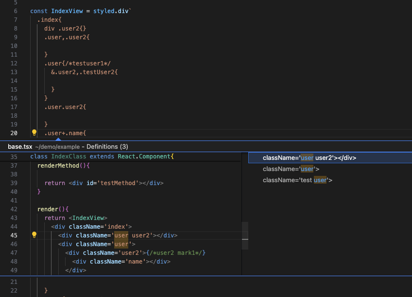
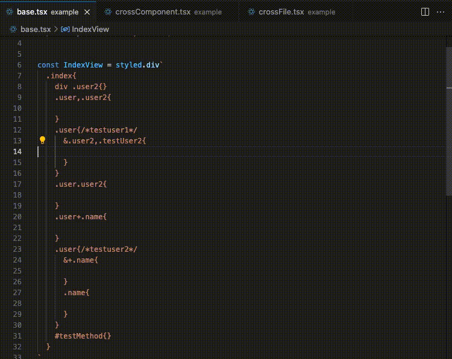

# vscode-styled-intelligent-plugin

### Description
vscode-styled-intelligent-plugin is an auxiliary vscode plugin that enhances the functionality of styled-components by providing intelligent navigation support.  
the plugin implemented based on [typescript-styled-intelligent-plugin](https://github.com/youxiaomi/typescript-styled-intelligent-plugin)

### Usage  

#### With VS Code

download the lastest vsix file from release pages.
press F1 and input ‘vsix’ in VScode,then select ‘install from vsix’。  
enjoy!

#### Troubleshooting
If you have any questions about plugin, please go to [Github](https://github.com/youxiaomi/typescript-styled-intelligent-plugin)